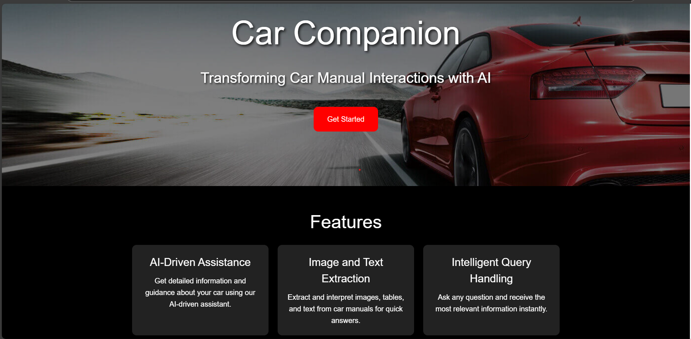
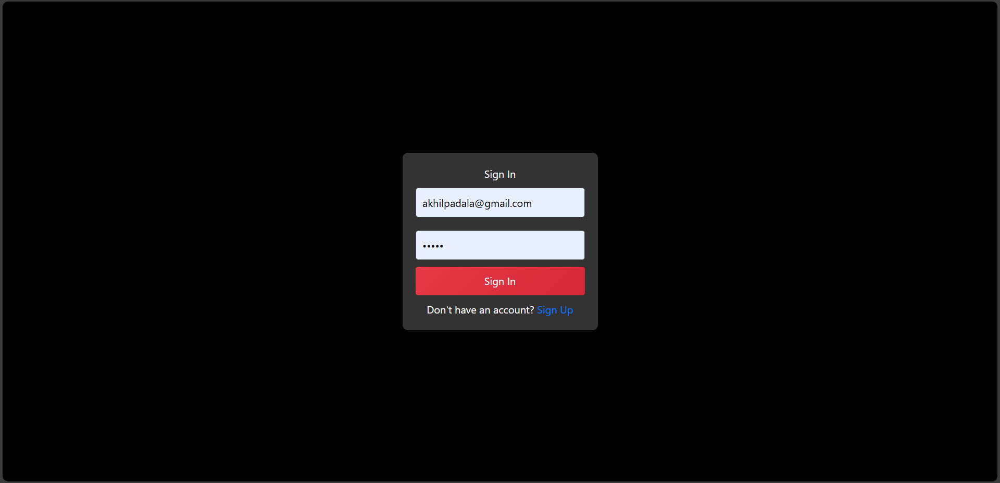
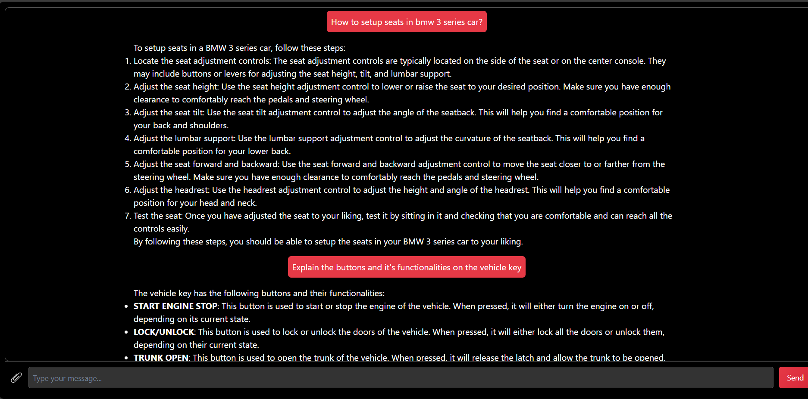

# Project Overview
CarCompanion is an AI-powered application designed to simplify the way users interact with car manuals. Instead of reading lengthy manuals, users can ask questions and receive instant, relevant answers. The system extracts and interprets text, tables, and images from car manuals, providing a seamless and intelligent query-handling experience.

## Features
- **AI-Driven Assistance**: Get detailed information and guidance about your car using our AI-driven assistant.
- **Image and Text Extraction**: Extract and interpret images, tables, and text from car manuals for quick answers.
- **Intelligent Query Handling**: Ask any question and receive the most relevant information instantly.

## How We Built This Project
We've used **React** for the frontend and **Node.js** with **Express** for the backend, while **MongoDB** serves as the database. 

For the chatbot, we implemented **Multimodal Retrieval-Augmented Generation (RAG)**. Our system processes unstructured data by extracting text, tables, and images from PDFs. 

- **LLaMA Vision Model**: Used to summarize tables and images.
- **GPT4All Embeddings**: Creates vector embeddings for the extracted content.
- **ChromaDB**: Stores processed images, text, and embeddings.
- When a user asks a question, the system retrieves relevant text, tables, or images and sends them to our RAG chain for precise answers.

## What Makes Us Unique
Most PDF-based question-answering tools struggle with long, complex documents like car manuals, which contain extensive text, intricate tables, images, and flowcharts. We have manually processed these PDFs to ensure our system can handle any question related to images, tables, or complex flowcharts.

Additionally, we have built this solution using **open-source models**, making it accessible for anyone to set up and use locally at no cost. This approach ensures flexibility and affordability while maintaining high performance.

# Project Setup Guide

## Prerequisites
- Node.js and npm installed
- Python installed
- Virtual environment module for Python
- Groq API Key
- Mongodb,Express,React installed

## Steps to Run the Project Locally

### 1. Setup and Start Frontend
```sh
cd frontend
npm i
npm start
```

### 2. Setup and Start Backend
Open a new terminal:
```sh
cd backend
npm i
cd src
node server.js
```

### 3. Setup Python Backend
Open another terminal:
```sh
cd backend
python -m venv myvenv
myvenv\Scripts\activate
pip install -r requirements.txt
cd src
cd app
python app.py
```

### 4. Groq API Key
Ensure you place your own **Groq API Key** in the necessary configuration files before running the project.


### 1. Landing Page


### 2. Sign-in Page


### 3. Chatbot Page


<!-- # Project Overview
CarCompanion is an AI-powered application designed to simplify the way users interact with car manuals. Instead of reading lengthy manuals, users can ask questions and receive instant, relevant answers. The system extracts and interprets text, tables, and images from car manuals, providing a seamless and intelligent query-handling experience.

## Features
- **AI-Driven Assistance**: Get detailed information and guidance about your car using our AI-driven assistant.
- **Image and Text Extraction**: Extract and interpret images, tables, and text from car manuals for quick answers.
- **Intelligent Query Handling**: Ask any question and receive the most relevant information instantly.

## How We Built This Project
We've used **React** for the frontend and **Node.js** with **Express** for the backend, while **MongoDB** serves as the database. 

For the chatbot, we implemented **Multimodal Retrieval-Augmented Generation (RAG)**. Our system processes unstructured data by extracting text, tables, and images from PDFs. 

- **LLaMA Vision Model**: Used to summarize tables and images.
- **GPT4All Embeddings**: Creates vector embeddings for the extracted content.
- **ChromaDB**: Stores processed images, text, and embeddings.
- When a user asks a question, the system retrieves relevant text, tables, or images and sends them to our RAG chain for precise answers.

## What Makes Us Unique
Most PDF-based question-answering tools struggle with long, complex documents like car manuals, which contain extensive text, intricate tables, images, and flowcharts. We have manually processed these PDFs to ensure our system can handle any question related to images, tables, or complex flowcharts.

Additionally, we have built this solution using **open-source models**, making it accessible for anyone to set up and use locally at no cost. This approach ensures flexibility and affordability while maintaining high performance.

# Project Setup Guide

## Prerequisites
- Node.js and npm installed
- Python installed
- Virtual environment module for Python
- Groq API Key
- MongoDB, Express, React installed

## Steps to Run the Project Locally

### 1. Setup and Start Frontend
```sh
cd frontend
npm i
npm start
```

### 2. Setup and Start Backend
Open a new terminal:
```sh
cd backend
npm i
cd src
node server.js
```

### 3. Setup Python Backend
Open another terminal:
```sh
cd backend
python -m venv myvenv
myvenv\Scripts\activate
pip install -r requirements.txt
cd src
cd app
python app.py
```

### 4. Groq API Key
Ensure you place your own **Groq API Key** in the necessary configuration files before running the project.

## Screenshots
Below are sections to paste screenshots of the application:

### 1. Landing Page


### 2. Sign-in Page


### 3. Chatbot Page
 -->